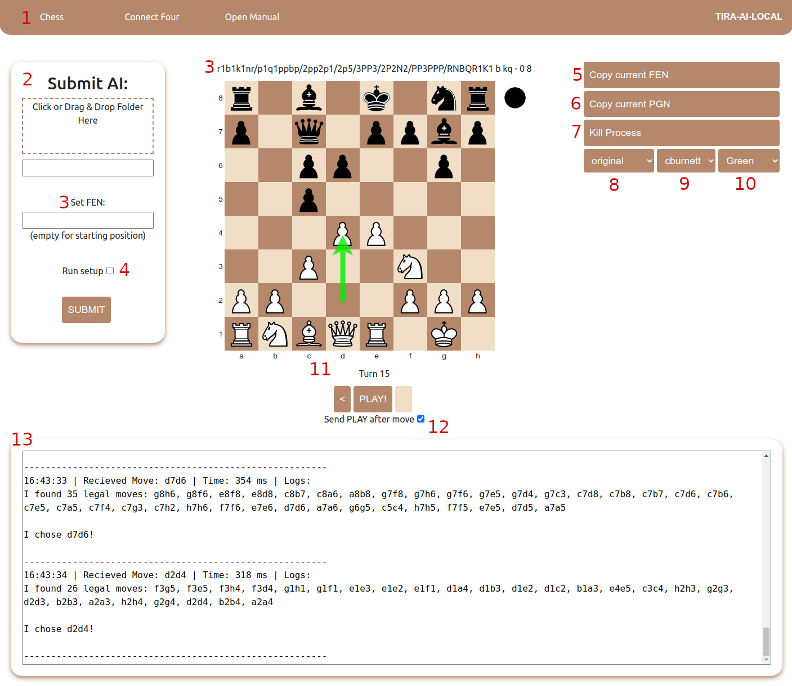
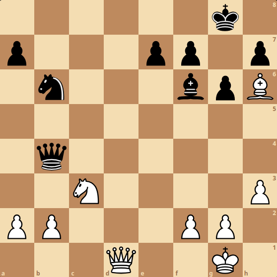
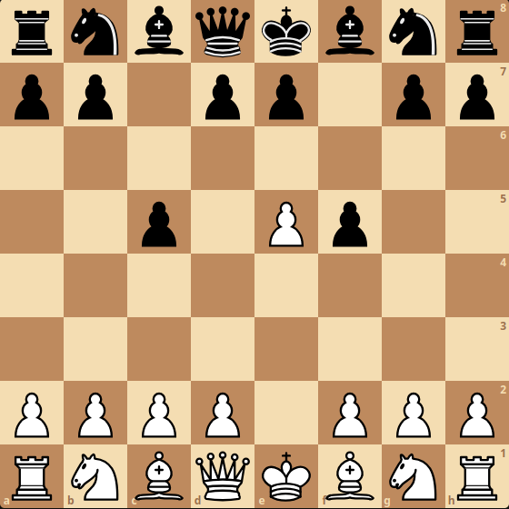

# tira-ai-local

Simple program to test game AI's. Currently supports Chess and Connect Four.

1. [Installation](#installation)
2. [Usage](#usage)
    - [AI Configuration](#ai-configuration)
    - [AI Structure](#ai-structure)
    - [AI Communication Protocol (Input)](#ai-communication-protocol-input)
    - [AI Communication Protocol (Output)](#ai-communication-protocol-output)
    - [Error Capturing](#error-capturing)
3. [User Interface](#user-interface)
4. [Game Specific Instructions](#game-specific-instructions)
    - [Chess](#chess)
    - [Connect Four](#connect-four)

## Installation

Download the [latest release](https://github.com/game-ai-platform-team/tira-ai-local/releases), unzip the package, open a terminal in the unzipped package, and run `./tira-ai-local`.

<details>
    <summary>Alternative Installation</summary>

#### Requirements

Ensure you have the following prerequisites installed on your system:

-   [Python](https://www.python.org/) 3.10 or newer
-   [Node.js](https://nodejs.org/en/download/current)
-   [Poetry](https://python-poetry.org/docs/#installation)

#### Installation Steps

1. Clone the repository:
    ```bash
    git clone https://github.com/game-ai-platform-team/tira-ai-local.git
    ```
2. Navigate to the `background-service` directory:
    ```bash
    cd tira-ai-local/background-service
    ```
3. Install the Python dependencies using Poetry:
    ```bash
    poetry install
    ```
4. Build the background service:
    ```bash
    poetry run invoke build
    ```
5. Navigate to the `app` directory:
    ```bash
    cd ../app
    ```
6. Install the Node.js dependencies using npm:
    ```bash
    npm install
    ```
7. Start the program:
    ```bash
    npm start
    ```

If you make any changes to the background service, you will have to build it again. If you want your changes to immediately take effect, instead of building the background service, you can also start it separately from the main app. In this case, open two terminals, one in `./app` and one in `./background-service`.

1. In `./background-service` run
    ```bash
    poetry run python3 src/app.py
    ```
2. Then in `./app` run
    ```bash
    npm start
    ```

#### Building Instructions

1. In the `./background-service` directory, run:
    ```bash
    poetry run invoke build
    ```
2. In the `./app` directory, run:
    ```bash
    npm run make
    ```

The built program can be found in the `./app/out/tira-ai-local-<platform>/` directory.

</details>

## Usage

Refer to the [example project](https://github.com/game-ai-platform-team/stupid-chess-ai) for a simple chess AI compatible with this program.

### AI Configuration

To integrate your AI project with this program, follow these steps:

1. **Directory Structure**: Organize your project with the following directory structure:

    ```
    /root
    |-- /src
    |-- /tiraconfig
    |   |-- runcommand
    |   |-- setup.sh
    ```

2. **runcommand**: This file contains the command to start your AI. It should be located within the `tiraconfig` directory. For example, if your Python AI is run from `main.py` within the `src` directory, the run command would be:

    ```bash
    python3 src/main.py
    ```

3. **setup.sh**: This shell script installs the dependencies of your AI and is executed when the *Run setup* option is toggled on. For Python projects using Poetry for dependency management, the setup script would look like this:

    ```shell
    poetry install
    ```

    Remember that when using poetry, your `runcommand` would now look like this:

    ```bash
    poetry run python3 src/main.py
    ```

    *IMPORTANT*: If running `setup.sh` causes any prompt (e.g. Do you want to install poetry?) it will not work and you will have to run `setup.sh` by yourself!

### AI Structure

Your AI should consist of a loop that runs continuously for the duration of the game. Make sure that your AI never exits the loop to keep it working with the program. In case your AI encounters an issue or gets stuck, you can use the `kill process` button to stop it or resubmit the path to restart the process.

<details>
    <summary>Python Example</summary>

```python
def main():
    while True:
        # Read input commands from the program
        command = input().strip()
        
        # Process input commands and generate output responses
        # Implement your AI logic here
        
if __name__ == "__main__":
    main()
```

</details>

### AI Communication Protocol (Input)

The program communicates with your AI using the standard pipe (command line). Your AI should read these commands as it would read any other input from the command line. In Python this would be `input()`.

Each command follows the format:

```
TAG:DATA
```

`TAG` represents the type of command and `DATA` is the accompanying data.

#### Tags

When your AI reads any of these tags, it should perform the described action:

-   `MOVE:<move>`

    -   **Action**: Someone played this move, process it.
    -   **Data Format**: The move made by the opponent. See the [game specific instructions](#game-specific-instructions) for the format each game uses.
    -   **Example**: `MOVE:e2e4` indicates White's opening move in chess.

-   `PLAY:`

    -   **Action**: Play one move in the current position. See the [output section](#ai-communication-protocol-output) for information on returning moves to the program.
    -   **Data Format**: None.

-   `BOARD:<board_state>`

    -   **Actions**: Set the board to the specified state.
    -   **Data Format**: A string representing the board state. See the [game specific instructions](#game-specific-instructions) for the format each game uses.
    -   **Example**: `BOARD:rnbqkbnr/pppppppp/8/8/8/8/PPPPPPPP/RNBQKBNR w KQkq - 0 1` sets a chess board to the starting position.

-   `RESET:`
    -   **Action**: Reset the board to the starting position.
    -   **Data Format**: None.

**Note:** Your AI may recieve multiple `PLAY:` or `MOVE:` tags in a row. It should be able to recognize whose turn it is, and play moves for either side in a game.

<details>
    <summary>Reading Tags Python Example</summary>

```python
def main():
    while True:
        command = input().strip()
        tag, data = command.split(":", 1)

        if tag == "MOVE":
            # Handle a user played move
        elif tag == "PLAY":
            # Play a move
        elif tag == "BOARD":
            # Set the board state
        elif tag == "RESET":
            # Reset the board

if __name__ == "__main__":
    main()
```

</details>

### AI Communication Protocol (Output)

The program reads your AI's output from the standard pipe (command line). In Python, you should use `print()` statements to provide moves to the program. The program will wait until it finds a tag, then read data until the first newline character (`\n`), after which it will process the received move. By default, Python's `print()` statements automatically include a newline at the end.

There is only one tag for output, `MOVE:`, which is used similarly to input. When given a `PLAY:`-tag, your AI should write `MOVE:<move>` to the command line. In python, if you wish to make the move `e2e4`, you would do this like so:

```python
print("MOVE:e2e4")
```

**Note**: Any outputs to the console that do not begin with `MOVE:` will be displayed in the log box of the program under the most recent `MOVE:` output. You can use this to debug your AI.

<details>

<summary>Example</summary>

This chess "AI" chooses predetermined moves from a list.

```python
def main():
    moves = ["e2e4", "b8b6", "g7g5", "c7c6", ... ]

    for move in moves:
        command = input().strip()

        print("This is before a move is returned")

        print(f"I moved {move}")
        print(f"MOVE.{move}") # This is not read as a move
        print(f"MOVE:{move}") # Only this is read as a valid move

        print("This is after a move is returned")

if __name__ == "__main__":
    main()
```

In this example, the program would read `e2e4` as the output from the AI and the log box would display:

```
--------------------------------------------------------
15:44:02 | Recieved Move: e2e4 | Time 0 ms | Logs:
This is before a move is returned
I moved e2e4
MOVE.e2e4
--------------------------------------------------------
```

The program would then process the move and wait for further input. After receiving the next `PLAY:` the AI chooses `b8a6` as its response. The log box would then display:

```
--------------------------------------------------------
15:44:05 | Recieved Move: b8a6 | Time 0 ms | Logs:
This is after a move is returned
This is before a move is returned
I moved b8b6
MOVE.b8b6
--------------------------------------------------------
```

</details>

### Error Capturing

In addition to reading and writing from the standard pipe, this program also captures any errors your AI writes in the standard error datastream (`stderr`). Everything written to `stderr` is displayed in the log box, along with the [Process ID](https://en.wikipedia.org/wiki/Process_identifier) and [return code](https://en.wikipedia.org/wiki/Exit_status) when the program detects your AI has finished execution.

Below is a log of [the example AI](https://github.com/game-ai-platform-team/stupid-chess-ai) crashing when being requested a move from a position with no legal moves:

```
--------------------------------------------------------
19:55:19 | Process 623932 finished with return code 1. Captured error message:
Traceback (most recent call last):
  File "/home/repos/stupid-chess-ai/src/stupid_ai.py", line 44, in <module>
    main()
  File "/home/repos/stupid-chess-ai/src/stupid_ai.py", line 30, in main
    choice = make_move(board)
             ^^^^^^^^^^^^^^^^
  File "/home/repos/stupid-chess-ai/src/stupid_ai.py", line 12, in make_move
    choice = random.choice(legal_moves)
             ^^^^^^^^^^^^^^^^^^^^^^^^^^
  File "/home/username/.pyenv/versions/3.12.2/lib/python3.12/random.py", line 347, in choice
    raise IndexError('Cannot choose from an empty sequence')
IndexError: Cannot choose from an empty sequence

--------------------------------------------------------
```

The log contains the PID (`623932`), return code (`1`) and the captured error message, which in this case is a Python traceback. As shown, the error occurred when attempting to randomly choose a move from an empty list.

**Note**: The error message can only be captured from the last active pipe once! If more than one new move is requested after a crash, the log will indicate that the error message couldn't be captured:

```
--------------------------------------------------------
19:57:52 | Process 623932 finished with return code 1. Captured error message:
Could not capture error message, most likely process has already finished.
--------------------------------------------------------
```

## User Interface



1. **Navigation Bar**
    - Use this to select the active game or read the manual.
    - Switching games will reset the active game and kill the AI process.
2. **Submit Form**
    - Submit your AI here. You can drag the root folder of your AI project into the box or type the path to the it in the field below.
    - If the given path is valid, the program will then execute the [`runcommand`](#ai-configuration) inside `./tiraconfig`. If configured correctly, this will start the AI process.
    - The process ID of the new process can be seen in the logs.
3. **FEN** *Chess Only*
    - If not empty or invalid, the game will be started in this position.
    - Current position in FEN is also shown above the gameboard.
    - See [the chess instructions](#chess) for more details on using FEN.
4. **Setup**
    - Check this box to run the [`setup.sh`](#ai-configuration) script in your AI's `./tiraconfig` directory before starting the AI process.
    - This only needs to be done for the first time you use your AI.
5. **Copy FEN** *Chess Only*
    - Copy the current position in FEN to clipboard.
6. **Copy PGN** *Chess Only*
    - Copy the game in [Portable Game Notation](https://en.wikipedia.org/wiki/Portable_Game_Notation) to clipboard.
    - You can use the PGN string to view and analyze your game in other applications, such as [lichess.org](https://lichess.org/paste).
7. **Kill Process**
    - Kill the active AI process.
    - Use this if your AI gets stuck and you don't want to restart the program or switch games.
8. **Select Theme**
    - Change the color theme of the program.
9. **Select Chesspieces** *Chess Only*
    - Change the chesspieces.
10. **Select Move Arrow** *Chess Only*
    - Set the color of the arrow showing the last move.
11. **Game Controls and Game Board**
    - Use `<` and `>` to undo or redo a move. This will send a `BOARD:<board>` command to your AI.
    - Use `PLAY` to request a new move from your AI. This will send a `PLAY:` command to your AI.
    - You can move the chesspieces on the chessboard and click on the Connect Four board to play a move. This will send a `MOVE:<move>` command to your AI.
12. **Send PLAY after move**
    - If *Send PLAY after move* is toggled on, a `PLAY:` command will be automatically sent to your AI after you make a move on the board.
13. **Log Box**
    - You can see information about the program and outputs from your AI here. When your AI outputs a `MOVE:<move>` tag, the box will display all other outputs from your AI as logs in the following format:

        ```
        <system time> | Recieved Move: <AI move> | Time: <move time> | Logs: <AI logs>
        ```

        - `<system time>`: Current system time.
        - `<AI move>`: The output from your AI.
        - `<move time>`: How long it took (in milliseconds) between sending `PLAY:` and recieving `MOVE:<move>`.
        - `<AI logs>`: Outputs your AI made that did not begin with the `MOVE:` tag. 

## Game Specific Instructions

### Chess

#### Moves (UCI)

Moves are communicated using [Universal Chess Interface (UCI)](https://en.wikipedia.org/wiki/Universal_Chess_Interface). In UCI, moves are represented by indicating the origin and destination squares of the moving piece. For example `e2e4` means that the piece in `e2` (pawn at game start) moves to `e4`.

Promotions are represented by a single character at the end of the move. If a pawn in `e7` moves to `e8` and promotes to a queen, this is written as `e7e8q`. Possible promotions are knight (`n`), bishop (`b`), rook (`r`) and queen (`q`).

When [castling](https://en.wikipedia.org/wiki/Castling), the king is the moving piece. For example, if White castles kingside, this is written as `e1g1`.

#### Boards (FEN)

Boards are represented using [Forsyth–Edwards Notation (FEN)](https://en.wikipedia.org/wiki/Forsyth%E2%80%93Edwards_Notation). A FEN string is a record of a game position. The string is formed from 6 different parts, each separated using a space.

Below is a breakdown of the starting position in FEN, `rnbqkbnr/pppppppp/8/8/8/8/PPPPPPPP/RNBQKBNR w KQkq - 0 1`:

1. **Piece placement data:** `rnbqkbnr/pppppppp/8/8/8/8/PPPPPPPP/RNBQKBNR`
    - Each row of the chess board, from left to right and top to bottom (from White's perspective), separeted with slashes (`/`).
    - Each piece is represented by a single character, upper case for White and lower case for Black. The pieces are pawn (`p`), bishop (`b`), knight (`n`), rook (`r`), queen (`q`) and king (`k`).
    - Empty squares are noted by a number showing how many there are. For example, `/P2P4/` would be displayed as
    - 
    - A complex board state might look like this `6k1/p3pp1p/1n3bpB/8/1q6/2N4P/PP3PP1/3Q2K1`, which is pictured below
    - 
2. **Active Color:** `w`
    - Whose turn it is, Black (`b`) or White (`w`).
3. **Castling availability:** `KQkq`
    - Which sides each color can castle. Upper case for White and lower case for Black. `KQkq` means both colors can castle both ways. `Qk` would mean that White can castle queenside and Black can castle kingside. `-` means that neither side can castle.
4. **En passant target square:** `-`
    - If this square is not a line (`-`), it means that a pawn can move to that square to do an _[en passant](https://en.wikipedia.org/wiki/En_passant)_. For example, if Black moves `f7f5` this would read `f6`. This means that White can use a pawn in `e5` or `g5` to capture the Black pawn in `f5` by moving to `f6`.
    - Below is a board in position `rnbqkbnr/pp1pp1pp/8/2p1Pp2/8/8/PPPP1PPP/RNBQKBNR w KQkq f6 0 3`, where White can *en passant* with the pawn in `e5` by moving it to `f6`
    - 
5. **Halfmove clock:** `0`
    - The number of moves since a piece was captured or a pawn was moved. This program uses the [fifty-move rule](https://en.wikipedia.org/wiki/Fifty-move_rule), which means that the game will be declared a draw if the number of halfmoves reaches 100. Your AI does not need to keep track of this.
6. **Fullmove number:** `1`
    - The number of full moves. Increases by one every time it is White's turn (so after Black makes a move). Your AI does not need to keep track of this.

#### Using FEN with the program

You can use the [lichess.org board editor](https://lichess.org/editor) to easily create FEN strings. When starting a game, you can input a valid FEN string into the designated field to set the initial position of the game. If the entered FEN is invalid or the field is left empty, the game will start from the standard starting position.

In the program's user interface, you have the option to undo and redo moves. Each time you perform an undo or redo action, a FEN string representing the current board position is sent to your AI. For instance, if you undo a move to revert to the position `r1bqkbnr/pp1ppppp/2n5/1Bp5/4P3/5N2/PPPP1PPP/RNBQK2R b KQkq - 2 3`, Your AI will receive the following:

```
BOARD:r1bqkbnr/pp1ppppp/2n5/1Bp5/4P3/5N2/PPPP1PPP/RNBQK2R b KQkq - 2 3
```

Additionally, a log will be displayed in the log box:

```
--------------------------------------------------------
17:05:40 | Setting AI board to r1bqkbnr/pp1ppppp/2n5/1Bp5/4P3/5N2/PPPP1PPP/RNBQK2R b KQkq - 2 3
```

**Note:** If setting the board fails for any reason, you will be notified with an error message:
```
17:05:40 | Setting board failed: 
<error message>
--------------------------------------------------------
```

If your AI process is no longer running, attempting to undo or redo moves results in a "broken pipe" error (`[Errno32]: Broken pipe`). To fix this, you must resubmit your AI.


### Connect Four

Moves in Connect Four are represented by the index of the column where the player wants to drop their disc. For example, placing a disc in the first column would be represented as `MOVE:0`, the second column as `MOVE:1`, and so on.

Boards are given as a string of moves separated by commas. The first move is made by red, the second by yellow and so on. For example, consider a board with two red moves in the first column and two yellow moves in the last column. It would be given as `BOARD:0,6,0,6`, which is shown below.


