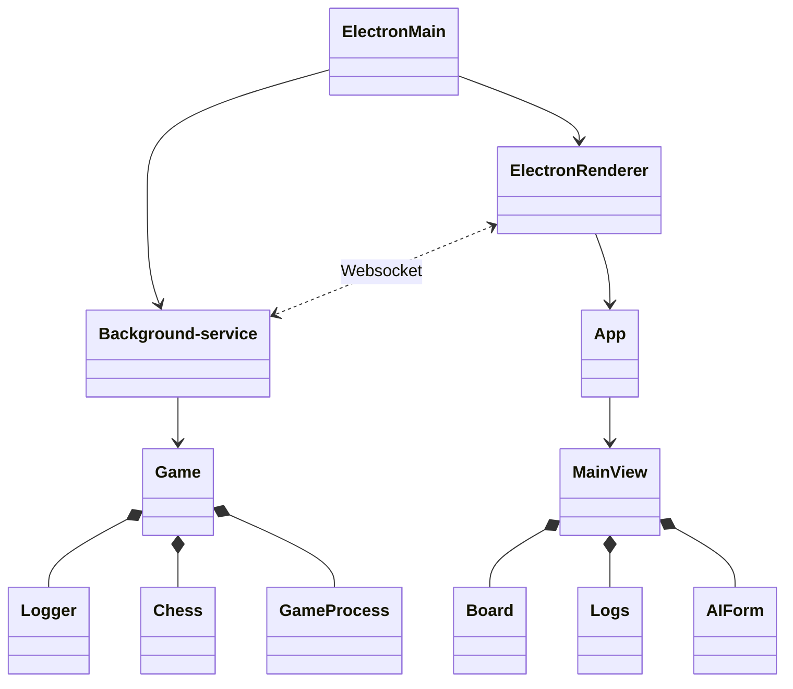

# Architecture

Websocket-based communications occur through App, using socket service. Chess, gomoku, connect4 and othello are subprocesses that run within a Game instance.

```mermaid
classDiagram
    class Electron Main {
    }
    class Electron Renderer {
    }
    class App {
    }
    class MainView {
    }
    class Board {
    }
    class Logs {
    }
    class AIForm {
    }


    class Background-service {

    }
    class Game {
    }
    class Logger {
    }
    class Chess {
    }
    class Game Process {
    }


    Electron Main --> Electron Renderer
    Electron Main --> Background-service
    Electron Renderer <..> Background-service: Websocket
    Electron Renderer --> App
    App --> MainView
    MainView *-- Board
    MainView *-- Logs
    MainView *-- AIForm
    Background-service --> Game
    Game *-- Logger
    Game *-- Chess
    Game *-- Game Process
```
